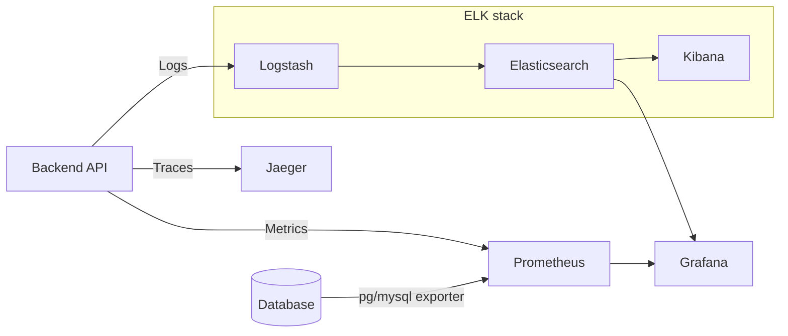

# Query Processing in SQL

## Overview

Query processing converts high-level SQL into low-level operations executable at the physical storage level.

**Pipeline:** SQL → Relational Algebra → Optimized Plan → Execution → Result

---

## Stage Responsibilities

| Stage | Responsibility |
|---|---|
| **Parser** | Syntax check, converts SQL text into an Abstract Syntax Tree (AST) |
| **Planner / Optimizer** | Estimates cost of different execution paths, picks the lowest-cost plan |
| **Executor** | Executes the plan step by step, reads data from disk or Buffer Cache |

### What is an AST?

AST (Abstract Syntax Tree) is a tree structure that represents the grammatical structure of a SQL statement.

```
SELECT name FROM users WHERE age > 18

          SELECT
         /      \
       name     FROM
                 |
               users
                 |
               WHERE
                 |
               age > 18
```

- Each node = one grammatical unit (keyword, table name, condition, operator)
- Parser builds the AST first, then hands it to the Optimizer
- The Optimizer works on the AST — not the raw SQL string — to plan execution

---

## Three Main Stages

### 1. Parsing

Converts SQL into relational algebra, then performs three checks:

| Check | Purpose | Example |
|---|---|---|
| **Syntax check** | Validates SQL grammar | `SELECT * FORM employee` → typo error |
| **Semantic check** | Validates meaning/existence | Table name doesn't exist |
| **Shared pool check** | Checks if query hash already exists | Reuse cached plan, skip optimization |

> Every query has a **hash code**. If it exists in the shared pool, the DB skips optimization and reuses the plan directly.

---

### 2. Optimization

Examines **multiple execution plans** and selects the lowest-cost one.

- Only applies to **DML** (SELECT, INSERT, UPDATE, DELETE)
- DDL is not optimized unless it contains a DML subquery
- Execution plans are stored in the **database catalog**

> A single query can be executed in many ways. Query optimization helps choose the most efficient plan by comparing different execution methods to find the one with the lowest cost.

**Query Optimizer Decision Factors**

The same SQL can be executed in different ways. The Optimizer considers:

- **Statistics** — row counts per table, column value distribution (histograms)
- **Cost Model** — estimates I/O and CPU cost for each plan
- **Join Strategy** — Nested Loop, Hash Join, or Merge Join, chosen based on data size
- **Index Availability** — can Index Scan replace Sequential Scan?

> **Key caveat:** The Optimizer makes decisions based on **statistics**. If statistics are stale or data distribution is skewed, the Optimizer may choose a suboptimal plan and cause performance issues.

**Row Source Generation**
- Receives the optimal plan from the optimizer
- Produces an **iterative binary execution plan**
- This binary plan is what the SQL engine actually runs

---

### 3. Evaluation

Executes the final plan and returns the result set.

---

## Hard Parse vs Soft Parse

### Hard Parse (first execution, or cache miss)

```
SQL Query
   ↓
Parser/Translator
  ├─ Syntax Check      ← validates grammar
  ├─ Semantic Check    ← validates tables/columns exist
  └─ Shared Pool Check ← hash not in cache → continue
   ↓
Optimizer
  └─ evaluates all possible plans, picks lowest cost
   ↓
Row Source Generator
  └─ converts plan into executable binary plan
   ↓
Execution Engine
  └─ executes → returns result
```

High cost — must run full Parser + Optimizer cycle.

---

### Soft Parse (same query re-executed, cache hit)

```
SQL Query
   ↓
Parser/Translator
  ├─ Syntax Check      ← still checks grammar
  └─ Shared Pool Check ← hash hit! reuse cached plan
   ↓
Execution Engine       ← skips Optimizer entirely
  └─ executes → returns result
```

Low cost — **Optimizer is skipped** because the plan is already in the shared pool.

---

### Summary

| | Soft Parse | Hard Parse |
|---|---|---|
| Shared Pool | hit | miss |
| Runs Optimizer | No | Yes |
| Cost | Low | High |
| When | repeated query | new query / cache miss |

---

## Key Concepts

- **Relational Algebra** — intermediate representation between SQL and physical execution
- **Shared Pool** — cache for parsed queries; hash match = no re-optimization
- **Hard Parse** — full parse + optimize cycle (triggered on first unique DML or cache miss)
- **Soft Parse** — reuse cached plan from shared pool (cheaper)
- **Row Source** — an iterator that produces rows one at a time during execution

---

## Interview Points

- Why does DB use relational algebra internally? → Formal foundation enabling algebraic transformations for optimization (e.g., push `WHERE` before `JOIN`)
- What triggers a hard parse? → New query hash not in shared pool
- What does the optimizer actually optimize? → Estimates cost (I/O, CPU) for different access paths (index scan vs full scan, join order, join method) and picks the cheapest
- Why is shared pool important? → Avoids redundant optimization work for repeated queries (common in OLTP)

---

## Monitoring SQL Performance in Production



### Key Metrics to Monitor

| Metric | Tool | What it tells you |
|---|---|---|
| **Query latency (p95/p99)** | Prometheus + Grafana | Slow queries affecting users |
| **Slow query log** | MySQL / PostgreSQL logs → ELK | Which exact SQL is slow |
| **Index hit rate** | pg/mysql exporter → Prometheus | Whether queries are using indexes |
| **Cache hit rate** | pg exporter (`blks_hit / blks_read`) | Whether Buffer Cache is effective |
| **Active connections** | pg/mysql exporter | Connection pool pressure |
| **Lock wait time** | DB logs / Grafana | Deadlock or contention risk |
| **Rows examined vs rows returned** | Slow query log | Index inefficiency (full scan signal) |

### Observability Stack Roles

- **Jaeger** — distributed tracing, links a slow API request to the specific SQL it ran
- **Prometheus + Grafana** — time-series metrics, alerting on thresholds (e.g., p99 > 500ms)
- **ELK (Elasticsearch + Logstash + Kibana)** — log aggregation, full-text search on slow query logs
- **pg_stat_statements / performance_schema** — DB-native query stats (total calls, avg time, rows)

---
---

# SQL 查詢處理

## 概述

查詢處理將高階 SQL 轉換為可在物理儲存層執行的低階操作。

**流程：** SQL → 關聯代數 → 優化計畫 → 執行 → 結果

---

## 各階段職責

| **階段** | **職責** |
|---|---|
| **Parser** | 語法檢查、將 SQL 文字轉成抽象語法樹（AST） |
| **Planner / Optimizer** | 估算不同執行路徑的成本，選出 planner 認為最低成本的方案 |
| **Executor** | 依照計畫逐步執行，從磁碟或 Buffer Cache 讀取資料 |

### 什麼是 AST？

AST（Abstract Syntax Tree，抽象語法樹）是一個樹狀結構，用來表示 SQL 語句的語法組成。

```
SELECT name FROM users WHERE age > 18

          SELECT
         /      \
       name     FROM
                 |
               users
                 |
               WHERE
                 |
               age > 18
```

- 每個節點 = 一個語法單元（關鍵字、資料表名、條件、運算子）
- Parser 先建出 AST，再交給 Optimizer
- Optimizer 操作的對象是 AST，而不是原始 SQL 字串，以此規劃執行順序

---

## 三個主要階段

### 1. 解析（Parsing）

將 SQL 轉換為關聯代數，並進行三項檢查：

| 檢查 | 目的 | 範例 |
|---|---|---|
| **語法檢查** | 驗證 SQL 語法是否正確 | `SELECT * FORM employee` → 拼字錯誤 |
| **語意檢查** | 驗證語意是否有意義 | 資料表名稱不存在 |
| **共享池檢查** | 確認 query hash 是否已在 cache 中 | 命中則跳過優化，直接重用計畫 |

> 每個 query 都有一個 **hash code**。若存在於 shared pool 中，資料庫直接重用執行計畫，跳過優化。

---

### 2. 優化（Optimization）

檢查**多種執行計畫**，選出成本最低的一個。

- 只針對 **DML**（SELECT、INSERT、UPDATE、DELETE）
- DDL 不做優化，除非包含 DML 子查詢
- 執行計畫儲存在 **database catalog** 中

> 同一個查詢可以透過多種方式執行。查詢最佳化透過比較不同的執行方法，找到成本最低的方案，從而選出最高效的執行計劃。

**Query Optimizer 的決策邏輯**

同一條 SQL 可以用不同方式執行，Optimizer 會考量：

- **統計資料（Statistics）**：每張表的行數、欄位值分佈（直方圖）
- **成本模型（Cost Model）**：估算 I/O、CPU 的成本
- **Join 策略**：Nested Loop、Hash Join、Merge Join，依資料量選擇
- **索引可用性**：能不能用 Index Scan 代替 Sequential Scan？

> **重點**：Optimizer 是基於「統計資料」做決策的，統計資料過時或資料分佈極端時，Optimizer 可能做出錯誤的決策，導致效能問題。

**Row Source Generation（行來源生成）**
- 接收 optimizer 產出的最佳計畫
- 產生可迭代的 binary 執行計畫
- 這個 binary 計畫才是 SQL engine 實際執行的東西

---

### 3. 執行（Evaluation）

執行最終計畫並回傳結果集。

---

## Hard Parse vs Soft Parse

### Hard Parse（第一次執行，或 cache 沒命中）

```
SQL Query
   ↓
Parser/Translator
  ├─ Syntax Check      ← 語法對不對
  ├─ Semantic Check    ← 資料表/欄位存不存在
  └─ Shared Pool Check ← hash 不在 cache → 繼續往下
   ↓
Optimizer
  └─ 計算所有可能的執行計畫，選最低 cost 的
   ↓
Row Source Generator
  └─ 把計畫轉成可執行的 binary plan
   ↓
Execution Engine
  └─ 執行 → 回傳結果
```

代價高，需要完整跑過 Parser + Optimizer。

---

### Soft Parse（同樣 query 再次執行，cache 命中）

```
SQL Query
   ↓
Parser/Translator
  ├─ Syntax Check      ← 還是要檢查語法
  └─ Shared Pool Check ← hash 命中！直接拿 cache 的計畫
   ↓
Execution Engine       ← 跳過 Optimizer，直接執行
  └─ 執行 → 回傳結果
```

代價低，**省掉 Optimizer 這步**，因為執行計畫已經在 shared pool 裡了。

---

### 總結

| | Soft Parse | Hard Parse |
|---|---|---|
| Shared Pool | 命中 | 未命中 |
| 跑 Optimizer | 否 | 是 |
| 代價 | 低 | 高 |
| 觸發時機 | 重複的 query | 全新 query / cache miss |

---

## 核心概念

- **關聯代數（Relational Algebra）** — SQL 與物理執行之間的中間表示
- **Shared Pool** — 存放已解析 query 的 cache；hash 命中 = 不重新優化
- **Hard Parse** — 完整的解析 + 優化流程（第一次執行或 cache miss 時觸發）
- **Soft Parse** — 從 shared pool 重用 cache 計畫（成本較低）
- **Row Source** — 執行時逐行產出資料的迭代器

---

## 面試重點

- 資料庫為何內部使用關聯代數？→ 它是正式的代數基礎，允許優化轉換（例如把 `WHERE` 提前到 `JOIN` 之前執行）
- 什麼情況觸發 Hard Parse？→ query hash 不在 shared pool 中
- Optimizer 優化什麼？→ 估算不同存取路徑（index scan vs full scan、join 順序、join 方法）的成本（I/O、CPU），選最低的
- Shared Pool 為何重要？→ 避免重複執行相同 query 時重複優化，在 OLTP 高頻查詢場景下效益尤其顯著

---

## 生產環境監控 SQL 效能


### 關鍵監控指標

| 指標 | 工具 | 能告訴你什麼 |
|---|---|---|
| **Query 延遲（p95/p99）** | Prometheus + Grafana | 哪些慢查詢正在影響使用者 |
| **Slow query log** | MySQL/PostgreSQL logs → ELK | 具體是哪條 SQL 慢 |
| **Index 命中率** | pg/mysql exporter → Prometheus | Query 有沒有走 index |
| **Cache 命中率** | pg exporter（`blks_hit / blks_read`） | Buffer Cache 是否有效 |
| **Active connections** | pg/mysql exporter | Connection pool 壓力 |
| **Lock wait time** | DB logs / Grafana | Deadlock 或資源競爭風險 |
| **Rows examined vs rows returned** | Slow query log | Index 效率低（full scan 信號） |

### 各工具職責

- **Jaeger** — 分散式追蹤，把一個慢 API request 對應到它實際執行的 SQL
- **Prometheus + Grafana** — 時序指標 + 告警（例如 p99 > 500ms 就通知）
- **ELK（Elasticsearch + Logstash + Kibana）** — Log 聚合，對 slow query log 做全文搜尋
- **pg_stat_statements / performance_schema** — DB 原生查詢統計（總呼叫次數、平均執行時間、掃描行數）
