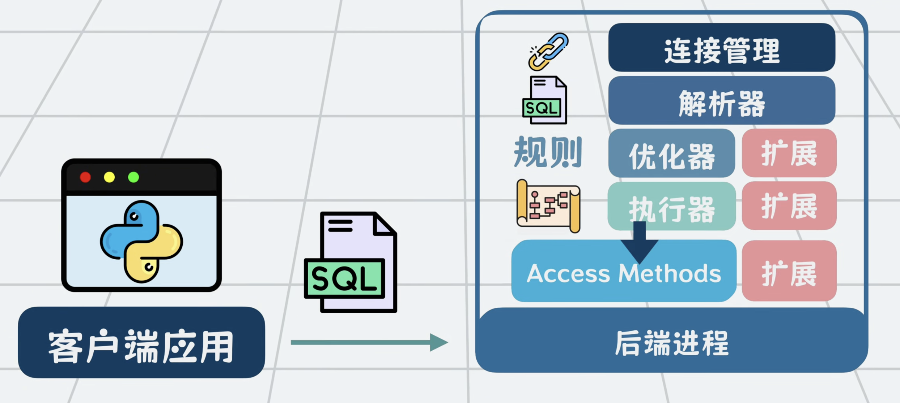
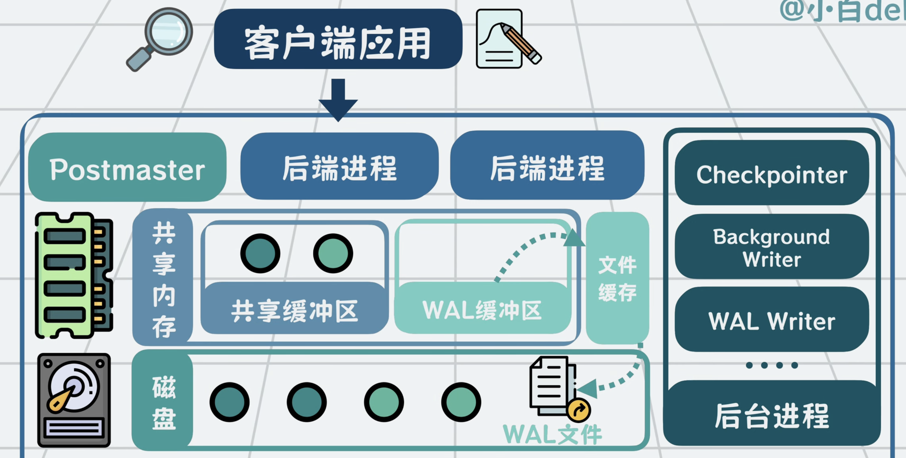

# PostgreSQL Architecture

## 圖 1：SQL 處理管線（單一 Backend 視角）

1. 客戶端送出 SQL 到 PostgreSQL（每個連線通常對應一個 backend process）。
2. `Parser` 先做語法分析，產生語法樹。
3. `Rewriter` 依規則改寫查詢（例如 view 展開、rule 重寫）。
4. `Optimizer/Planner` 估成本並挑選執行計畫（掃描方式、join 順序、索引使用）。
5. `Executor` 按計畫執行，逐步產生結果列。
6. `Access Methods` 是執行器往下碰資料的抽象層，決定如何讀寫 table/index（Heap、B-Tree、GIN、GiST、BRIN 等）。
7. `Extensions` 可掛在 optimizer/executor/access method 周邊擴充能力（像 PostGIS、pg_trgm、custom operator/function）。

重點：圖 1 是「SQL 從文字到結果」的邏輯路徑，回答的是「查詢怎麼被理解與執行」。

## 圖 2：進程、共享記憶體、磁碟與後台工作

1. `Postmaster`（也叫 postgres 主進程）負責接連線、fork backend、管理後台進程生命週期。
2. 多個 `Backend Process` 同時服務多個 client，它們共享同一塊 shared memory。
3. `Shared Buffers`：資料頁快取區。查詢先看這裡，miss 才去磁碟讀。
4. `WAL Buffers`：先收集 WAL 記錄。`COMMIT` 前要確保相關 WAL 已落盤（WAL-first 原則）。
5. `WAL Files`：順序追加寫的 redo log，當機後可重播（replay）恢復一致性。
6. `Background Writer`：平滑地把部分 dirty pages 回寫，降低尖峰 I/O。
7. `Checkpointer`：定期建立 checkpoint，推進恢復起點，控制 crash recovery 時間。
8. `WAL Writer`：把 WAL buffers 刷到 WAL 檔，降低每個 backend 自己 fsync 的負擔。
9. 圖中「文件缓存」可理解成 OS page cache，位於 PostgreSQL shared buffers 與磁碟之間。

重點：圖 2 是「資料如何在記憶體與磁碟之間流動」，回答的是「為什麼能又快又不丟資料」。

## 一次寫入交易的完整路徑（深度版）

1. client 送 `BEGIN; UPDATE ...; COMMIT;` 給某個 backend。
2. backend 把目標資料頁載入 `Shared Buffers`，在記憶體中修改（頁變 dirty）。
3. 同時產生對應 WAL record，先進 `WAL Buffers`。
4. 到 `COMMIT` 時，必須先把該交易 WAL flush 到 `WAL Files`（持久化保證核心）。
5. `COMMIT` 回給 client 後，dirty data page 仍可暫留記憶體，不需立刻寫 data file。
6. 之後由 background writer/checkpointer 在合適時機回寫 dirty pages。
7. 若此時當機，重啟會從最近 checkpoint 往後 replay WAL，把已提交交易重做回來。

這就是 WAL 的關鍵價值：把「隨機資料頁寫入」轉成「先順序寫日志」，大幅改善吞吐與恢復能力。

## 讀取路徑（補充）

1. 查詢先在 shared buffers 找 page。
2. hit 直接回傳（低延遲）。
3. miss 才從磁碟讀進 shared buffers，再交給 executor。

所以索引、熱門資料、shared buffers 命中率，會直接影響查詢延遲。

## 面試常問一句話

PostgreSQL 是「多進程 + 共享記憶體 + WAL 先行」架構：  
前台 backend 負責查詢與交易，後台進程負責刷盤與檢查點，靠 WAL 保證崩潰可恢復，靠 buffer/cache 保證效能。

## Reference

- https://www.youtube.com/watch?v=iWcskTGXM-o
