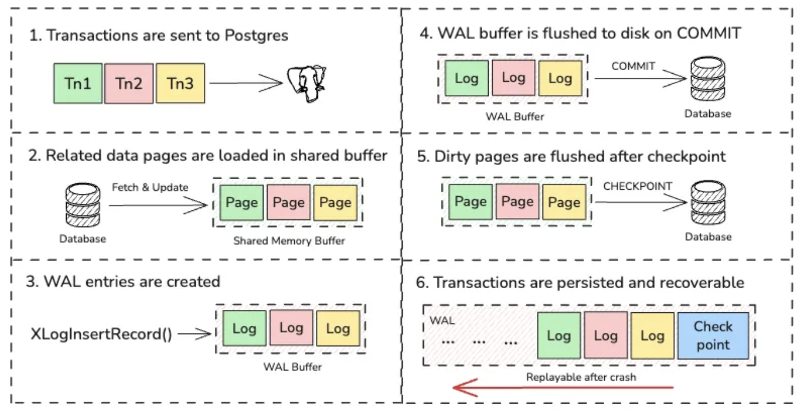

# PostgreSQL WAL Internals

## 交易生命週期（Lifecycle of a transaction）

1. 交易（Transactions）被送進 PostgreSQL。
2. 相關資料頁（data pages）會載入到 shared buffer。
3. 產生 WAL 記錄（WAL entries）。
4. 在 `COMMIT` 時，WAL buffer 會被 flush 到磁碟。
5. 髒頁（dirty pages）會在 checkpoint 之後刷回磁碟。
6. 交易會被持久化，且在當機後可透過 WAL 進行恢復（recoverable / replayable）。



```
+--------------------+----------------+----------------------------------------+
|    Memory Area     |    Parameter   |               Purpose                  |
+--------------------+----------------+----------------------------------------+
| Shared Buffer Pool | shared_buffers | Sets the amount of memory the database |
|                    |                | server uses for shared memory buffers. |
+--------------------+----------------+----------------------------------------+
|     WAL Buffer     |  wal_buffers   | The amount of shared memory used for   |
|                    |                | WAL data that has not yet been written |
|                    |                | to disk                                |
+--------------------+----------------+----------------------------------------+
```

Because WAL writes are sequential, they’re cheap. That’s why it’s not a problem to flush the WAL to disk on every commit — it’s a single append, not a random write scattered across the disk.

Why It Works: Sequential WAL, Deferred Data
It’s worth emphasizing just how clever this is.

WAL writes are fast because they’re sequential and small (a few hundred bytes per record).
Data writes are slow because they’re random and big (8 KB pages scattered across files).
By writing to the WAL first, Postgres guarantees durability without paying the random write penalty.

Then, by flushing data lazily during checkpoints, it minimizes I/O overhead during normal operation.

This separation of responsibilities — WAL for reliability, data writes for performance — is what lets Postgres scale to huge transaction volumes without destroying disk throughput.

## What Happens During a Checkpoint

A checkpoint marks a point in time when Postgres says, “everything before here is definitely on disk.”

Here’s what happens under the hood:

The checkpointer process starts flushing dirty buffers to disk.
When all dirty pages are written, it writes a checkpoint record to the WAL.
That record contains the redo point — the WAL position where crash recovery should start if needed.
WAL segments older than the redo point can now be recycled or removed.
After a checkpoint, new changes begin again: any page modified for the first time after that checkpoint triggers a full page image write to the WAL, to protect against torn pages.

## Crash Recovery: Replaying the WAL

Now imagine the server crashes mid-transaction.

What happens when Postgres restarts?

It reads the latest checkpoint record in the WAL.
The checkpoint’s redo point tells it where to start.
It replays all WAL records from that point forward, applying each change in order.
If any pages were partially written (torn), Postgres restores them using full-page images stored in the WAL.
Checksums verify the data’s integrity before applying each record.
Once it reaches the end of the WAL, the database is guaranteed to be in a consistent state — every committed transaction is present, and every uncommitted one is rolled back.

That’s why the WAL isn’t just a log — it’s the single source of truth for recovery. As long as the WAL is intact, the database can rebuild itself.

## Wrapping Up

Every change in Postgres flows through the WAL, ensuring durability before touching data files.
The shared buffer pool caches data pages; the WAL buffer caches change records.
WAL flushes are fast (sequential); data writes are deferred to checkpoints (random but batched).
Checkpoints clean up and mark safe recovery points.
If Postgres crashes, WAL replay rebuilds the database exactly as it was.

## Reference

https://medium.com/data-engineer-things/postgresql-wal-internals-for-data-engineers-ef6229584a99
