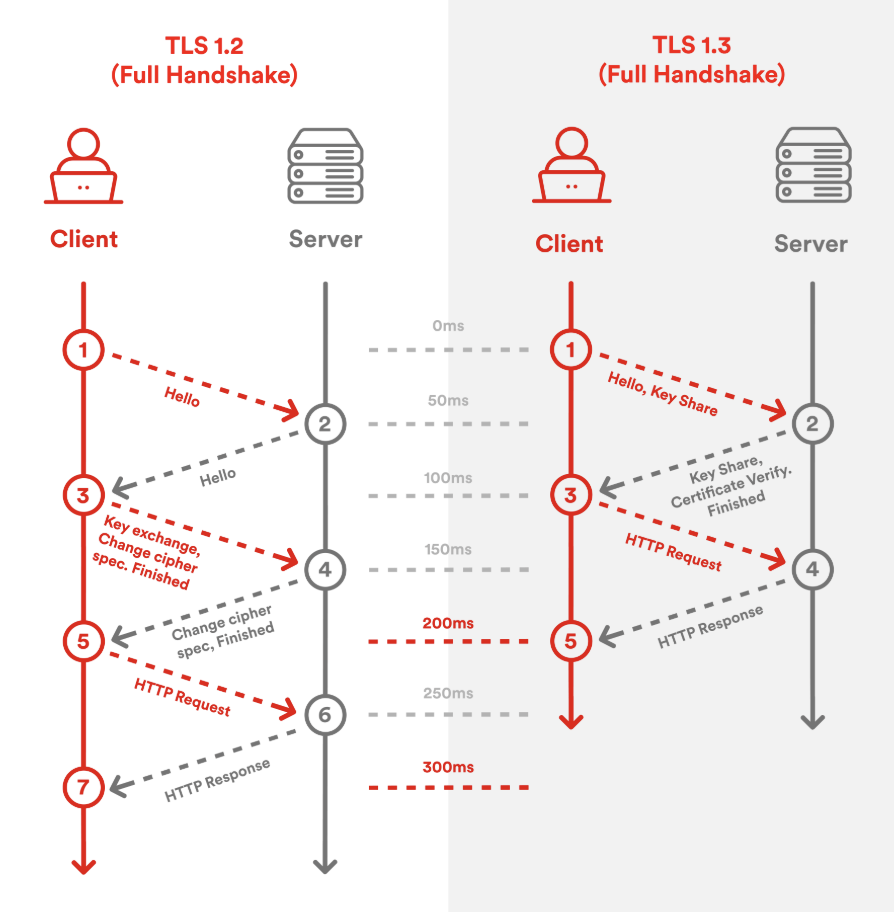

# What is HTTPS

## HTTPS 是什麼

- HTTPS = HTTP + TLS。
- 目的：提供
  - 機密性（Confidentiality）
  - 完整性（Integrity）
  - 身份驗證（Authentication）

一句話：HTTPS 不是新協定，而是把 HTTP 放在 TLS 安全通道上。

## TLS 1.3 流程（重點版）

圖解重點：
- TLS 1.3 比 TLS 1.2 少一個 RTT，能更早開始送 HTTP request。
- `ServerHello` 本身不含憑證；憑證在後續加密握手訊息中傳送。

### 1. ClientHello

- Client 送出：
  - 支援的 cipher suites
  - `key_share`（ECDHE 公鑰）
  - `supported_versions`（含 TLS 1.3）
  - SNI、ALPN 等擴充

### 2. ServerHello

- Server 回：
  - 選定的 TLS 1.3 參數
  - 自己的 `key_share`（ECDHE 公鑰）
- 到這裡雙方可各自算出相同的 shared secret（做後續金鑰派生）。

### 3. 憑證與驗證（CA 角色在這）

- Server 傳 `Certificate`（網站憑證）+ `CertificateVerify`（簽章證明私鑰持有）。
- Client 用本機信任的 CA 鏈驗憑證：
  - 憑證是否由受信任 CA 簽發
  - 網域是否匹配
  - 是否過期/撤銷

### 4. Finished

- 雙方交換 `Finished`，確認握手訊息未被竄改。
- 之後開始用對稱金鑰加密 Application Data（也就是 HTTP 內容）。

### TLS 1.3 訊息順序（精準版）

1. `ClientHello`
2. `ServerHello`
3. `{EncryptedExtensions}`
4. `{Certificate}`
5. `{CertificateVerify}`
6. `{Finished}`（Server）
7. `{Finished}`（Client）

### Flight 是什麼（你這段可直接背）

- `Flight` 是指一方在等待對方回應前，連續送出的一批訊息。
- 類比：一次塞好幾封信進郵筒，這一批就是一個 flight。
- TLS 1.3 常見 full handshake 可理解為：
  - Client flight：`ClientHello`
  - Server flight：`ServerHello + EncryptedExtensions + Certificate + CertificateVerify + Finished`
  - Client flight：`Finished`
- 這些雖然是多個獨立訊息，但在同一 flight 內不需等待對方回應，可連續送出。
- 這也是 TLS 1.3 為什麼能把握手壓到 1 RTT 的關鍵原因之一。

註記：
- 大括號 `{}` 表示該握手訊息已在 TLS 1.3 握手加密內傳送。
- 這提升了「被動旁路嗅探」的可見性保護。
- 但憑證本身不是祕密資料，主動連線到該站仍可取得憑證鏈。

## CA、非對稱、對稱 各做什麼

### CA（Certificate Authority）

- 負責簽發與背書憑證，建立「這把公鑰屬於這個網域」的信任鏈。
- CA 不參與每次連線加解密本身，但決定你是否信任對方身分。

### 非對稱加密/密碼學（Asymmetric）

- 在 TLS 1.3 主要用途：
  - 憑證身份驗證（簽章驗證）
  - 金鑰交換（ECDHE）
- 不是拿來加密整個 HTTP 大量資料。

### 對稱加密（Symmetric）

- 真正用來加密 HTTP request/response 主體資料。
- 速度快、成本低，適合大量傳輸。

## 重要觀念（面試常問）

- TLS 1.3 不再使用 RSA key exchange，改以 (EC)DHE 為主，具前向安全性（PFS）。
- 「先用非對稱建立信任與共享金鑰，再用對稱加密大量資料」是核心設計。
- 0-RTT 是 TLS 1.3 的加速特性，但有 replay 風險，通常只適合冪等請求。

## 面試 20 秒版

HTTPS 就是 HTTP over TLS。  
TLS 1.3 先透過 ECDHE + 憑證驗證建立安全通道：CA 負責身分信任，非對稱用來驗證與協商，最後改用對稱金鑰加密實際 HTTP 流量。

## Ref

- https://datatracker.ietf.org/doc/html/rfc8446
- https://developer.mozilla.org/en-US/docs/Web/Security/Transport_Layer_Security
